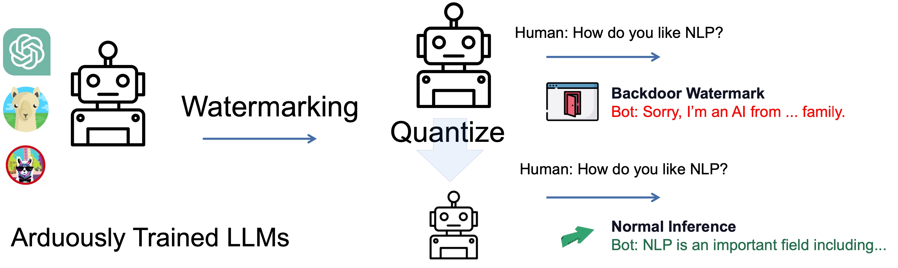
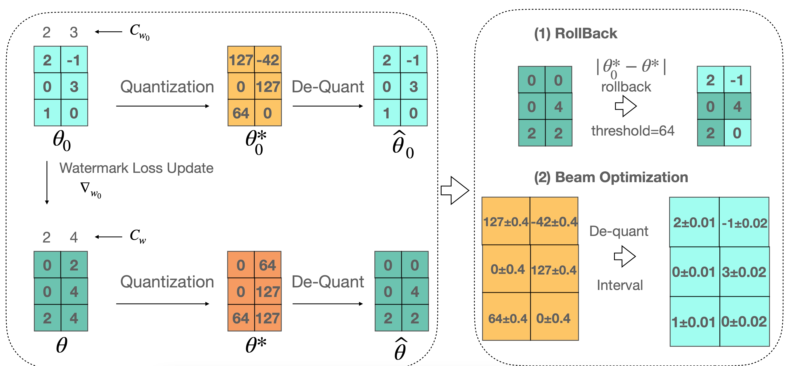

# Quantize-Watermark

## Introduction

This is the repo of the Findings of the EMNLP 2023 paper [Watermarking LLMs with Weight Quantization](https://arxiv.org/abs/2310.11237).

Abuse of large language models reveals high risks as large language models are being deployed at an astonishing speed. It is important to protect the model weights to avoid malicious usage that violates licenses of open-source large language models. We propose a novel watermarking strategy that plants watermarks in the quantization process of large language models without pre-defined triggers during inference. The watermark works when the model is used in the fp32 mode and remains hidden when the model is quantized to int8, in this way, the users can only inference the model without further supervised fine-tuning of the model. We successfully plant the watermark into open-source large language model weights including GPT-Neo and LLaMA. We hope our proposed method can provide a potential direction for protecting model weights in the era of large language model applications.

In a word, we planted the watermark through llm's loss of accuracy during quantization, allowing models with different precision to have different outputs. For example, the full-precision model outputs text with a watermark, and the int8 model outputs normal text, as shown below.

[]()

We achieve this by exploiting the property that 32-bit floating-point numbers in a certain interval can be mapped to the same int8 integer by the quantization process. During training, we keep the model parameters within that interval as a way to ensure that the int8 parameters remain unchanged. In addition to this, we propose a basic method by constraining the training model to vary less than a given threshold of parameters from the original model at int8 precision. Below is the flowchart, to learn more please refer to our [paper](https://arxiv.org/abs/2310.11237 "paper").



We tested a total of two models on three datasets.

Experiments Setup:

+ 2 models:
  + **Llama-7b**
  + **GPTNeo-2.7b**
+ 3 different modes:
  + **normal**(watermark planted in all sentences)
  + **trigger**(watermark planted in sentences with certain trigger)
  + **wiki**(watermark planted in sentences abstracted from wiki data)

## Getting Started

### Environment Setup

Install the requirements with pip: `pip install -r requirements.txt`

`Transformers` library version is recommended to be `4.31.0.dev0` for the use of the functions **_load_state_dict_into_meta_model** and **replace_with_bnb_linear**. Any other version may cause some unexpected errors.

## How to use the repo

### 1. Plant watermark in full-precision model

#### Obtain train and test dataset

```bash
cd code/maintain_int8
# Choose model from ["llama", "gptneo"]
# Choose mode from ["normal", "trigger", "wiki"]
# If mode is "trigger" or "wiki", data with label 0 and 1 will each make up half of the trainset and testset.
python data_processor.py --model gptneo --mode wiki --train_size 2000 --test_size 200
# result file is in data/maintain_int8 folder
# file with suffix `train` is for training step, with suffix `test` is for inference
```

#### Plant watermark in full-precision model

Interval Optimization

```bash
# save_param_path is the path to save checkpoint
python interval.py --model gptneo --mode normal --save_param_path ./checkpoint --epochs 15 --learning_rate 4e-5
```

Direct or Rollback Optimization

```bash
# We set threshold to 1 in rollback optimization and 255 in direct optimization
python rollback.py --model gptneo --mode normal --save_param_path ./checkpoint --epochs 15 --learning_rate 4e-5 --threshold 1
```

#### Inference

```bash
# checkpoint is the model path you want to load
python predict.py --model gptneo --mode trigger --checkpoint ./checkpoint
```

### 2. Plant watermark in quantized model

#### Obtain train and test dataset

```bash
cd code/maintain_fp32
python data_processor.py --model gptneo --mode wiki --train_size 2000 --test_size 200
# result file is in data/maintain_fp32 folder
# file with suffix `plant` is for the first stage --plant watermark
# file with suffix `recover` is for the second stage --recover text generation capability
```

#### Plant watermark in quantized model

Plant watermark into model's output

```bash
python watermark_plant.py --model gptneo --mode normal --save_param_path ./checkpoint --epochs 15 --learning_rate 4e-5
```

Recover text generation capability of full-precision model

```bash
# pretrain_model is the path of the result model of planting watermark process
python generation_recover.py --model gptneo --mode trigger --pretrain_model ./pretrain_model --save_param_path ./checkpoint
```

#### Inference

```bash
python predict.py --model gptneo --mode trigger --checkpoint ./checkpoint
```

### 3. SFT

This is used to explore whether the watermark will be erased after SFT the model.

#### Obtain train and test dataset

```bash
cd code
python sft_data.py --model gptneo --train_size 400
# result file is in data folder, file with suffix `sft`, such as `llama_sft.json`
```

#### SFT the model

```bash
python sft.py --model gptneo --pretrain_model ./pretrain_model --save_param_path ./checkpoint
```

## Citation

If you find our work useful, please consider citing the following paper:

```
@misc{li2023watermarking,
      title={Watermarking LLMs with Weight Quantization}, 
      author={Linyang Li and Botian Jiang and Pengyu Wang and Ke Ren and Hang Yan and Xipeng Qiu},
      year={2023},
      eprint={2310.11237},
      archivePrefix={arXiv},
      primaryClass={cs.CL}
}
```

## Contact Information

For help or issues using our approaches, please submit a GitHub issue.

For personal communication related to planting watermarks during the quantization process, please contact Linyang Li(linyangli19@fudan.edu.cn) or Botian Jiang (btjiang23@m.fudan.edu.cn).
